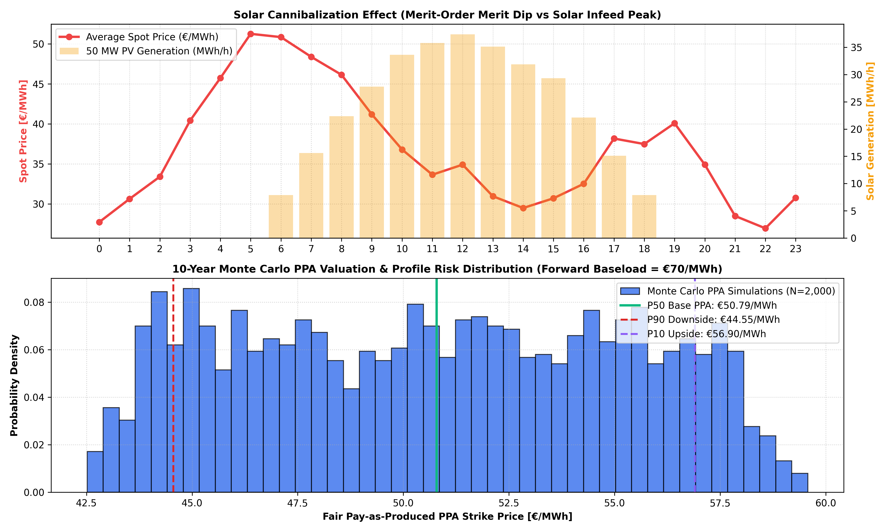

# ☀️ Renewable Cannibalization & 10-Year Monte Carlo PPA Valuation Engine

An 8,760-hour quantitative energy economics framework analyzing **Merit-Order solar price cannibalization (Marktwert Solar)** and modeling **10-year Pay-as-Produced Power Purchase Agreements (PPAs)** using Monte Carlo simulation in the German EPEX Spot wholesale power market.

---

## 📌 Commercial Context & Financial Mechanisms

* **The Cannibalization Effect:** Massive synchronous solar feed-in depresses wholesale power prices precisely during midday peak production hours (*Profile / Merit-Order Dip*), causing the volume-weighted **Capture Price (Marktwert Solar)** to diverge from arithmetic **Baseload prices**.
* **Capture Rate / Profile Factor:**
  $$\text{Capture Rate} = \frac{\text{Volume-Weighted Capture Price (€/MWh)}}{\text{Average Baseload Price (€/MWh)}} \times 100\%$$
* **PPA Valuation Model:** 10-year forward contract risk simulation incorporating future solar build-out projections, shape degradation, and volumetric offtaker risk discounts.

---

## 📊 8,760h Annual Results & 10-Year Monte Carlo PPA Pricing (50 MW PV)

| Metric | Simulated Output | Economic Interpretation |
| :--- | :---: | :---: |
| **50 MW PV Annual Generation** | **75,727.25 MWh** | 1,514.5 Full Load Hours (FLH) |
| **Average Annual Baseload Price** | **€56.11 / MWh** | Unweighted Spot Market Benchmark |
| **Solar Capture Price (Marktwert)** | **€53.47 / MWh** | Realized Volume-Weighted Capture Value |
| **Solar Capture Rate (Profile Factor)** | **95.3%** | -4.7% Cannibalization Shape Discount |
| **P50 Base Fair PPA Strike Price** | **€50.79 / MWh** | Fair-value 10-year Pay-as-Produced Contract |
| **P90 Downside Risk PPA Price** | **€44.55 / MWh** | Bankable Debt-Service Floor |
| **P10 Upside Case PPA Price** | **€56.90 / MWh** | Merchant Capture Upside Scenario |

---

## 📈 Visual Benchmark: Diurnal Merit Dip & Monte Carlo PPA Distribution

---

## 🛠️ Tech Stack
* **Language:** Python 3.10+
* **Data Science & Risk Simulation:** `numpy`, `pandas` (Monte Carlo N=2,000)
* **Visualization:** `matplotlib`
